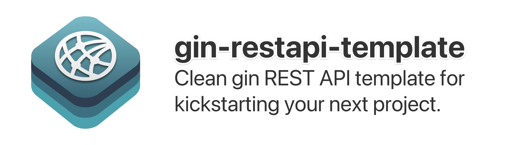

<div align="center">



<a href="https://github.com/alexmodrono/gin-restapi-template/generate"></a>

</div>

## Index

<!-- Pages -->
[overvw]: #project-overview-
[motiv]: #motivation-
[gs]: #get-started-
[td]: #todo-list-
[sql]: #custom-database-queries

<!-- Links -->
- [Project Overview 📋][overvw]
- [Motivation 💪][motiv]
- [Get Started 🏃‍♂️][gs]
- [TODO list 📝][td]
- [Custom database queries][sql]

## Project Overview 📋
`alexmodrono/gin-restapi-template` is a comprehensive and well-structured starting point for developing RESTful APIs using the Gin framework. This template aims to streamline the initial setup and provide a foundation for building robust and scalable APIs with a clean architecture.

The main key features include, but are not limited to:

- 🫧**Clean Architecture**: The template embraces a modular and organized structure based on the principles of Clean Architecture. It leverages the power of `go-fx` for robust dependency injection, enhancing maintainability, scalability, and code reusability.

- 🧭**Efficient Routing**: Utilizing the powerful routing capabilities of Gin, the template enables easy management of API endpoints, middleware, and request handling.

- 👷**Middleware Integration**: Built-in support for middleware such as authentication, logging, CORS, and more, allowing you to enhance your API's functionality and security with ease.

- ❗️**Error Handling**: The template includes a comprehensive error handling mechanism, ensuring consistent and informative error responses for better client interaction and debugging.

- 💾**Database Integration**: By leveraging the `pgx` driver, the template enables direct communication with PostgreSQL databases without the additional overhead and abstraction provided by an ORM. This approach provides more control and fine-grained optimization opportunities, allowing you to tailor the database interactions to the specific needs of your application.

- 🚦**Request Validation**: Implement request validation and data binding effortlessly by binding to DTOs, ensuring data integrity and security.

- 🧪**Testing Support**: The template encourages writing tests by providing a test-friendly structure, making it easier to verify the functionality and stability of your API.

Because of all the aforementioned reasons, by using this template you can expedite the development process of your next project as it allows you to focus on building your specific business logic while leveraging the proven architecture, routing, middleware, and other essential components provided.

Whether you're a seasoned developer or just starting with `Gin`, this template provides a solid foundation and best practices for creating clean, scalable, and production-ready REST APIs.

## Motivation 💪
Finding the perfect REST API template for `golang` and `Gin` can be a daunting task, as the existing options may not always fulfill all the specific requirements of your project. While several popular templates like [`dipeshdulal/clean-gin`](https://github.com/dipeshdulal/clean-gin/) and [`vsouza/go-gin-boilerplate`](https://github.com/vsouza/go-gin-boilerplate) have garnered attention, they might lack certain essential features you need to have a full-fledged REST API.

To address these limitations and create a more tailored solution, I decided to develop my own API template. This template not only solves many of the problems developers may find when starting their new project, but also incorporates several crucial functionalities for a clean and efficient API development process.

And one of the key features of the template is the implementation of dependency injection through `go.uber.org/fx`, which promotes better code organization and modularity. By using this approach, the API becomes more maintainable and easier to extend over time. This template also aims to teach how to use `go-fx` in complex codebases and even provides examples for how to do tests, which is something I struggled to find on the internet when developing this project.

Furthermore, this template intentionally avoids using an ORM (Object-Relational Mapping) to interact with databases. Instead, it uses `github.com/jackc/pgx`, a low-level, high performance interface that exposes PostgreSQL-specific features to Go. This way, it allows developers to utilize the full potential of native SQL queries, and it should be fairly easy to change the driver with one for your preferred database.

Additionally, the template includes built-in support for validating both `json` and `form url-encoded` request bodies. By incorporating this validation mechanism, developers can ensure that incoming data is accurately validated and processed, leading to enhanced data integrity and security.

To ensure a consistent and well-organized project structure, this template adheres to the standard golang folder structure. This practice not only improves the readability of the codebase but also enables other developers to quickly grasp the project's layout.

In terms of error handling, the template focuses on user-friendly messages and informative responses. By providing clear and meaningful error messages, the API users can easily understand and troubleshoot any issues they might encounter, thereby enhancing the overall user experience.

Additionally, as I further iterated on the template, I incorporated more features that cater to various use cases and requirements, such as CORS, logging, user authentication and authorization, custom SQL query functions, among others.

In conclusion, this custom REST API template for `golang` and `Gin` is designed to encompass a comprehensive set of features while maintaining simplicity and flexibility. By combining dependency injection, absence of ORM, data validation, standardized folder structure, user-friendly error handling, and various other functionalities, this template serves as a solid foundation for developing clean, efficient, and tailored APIs to suit your specific needs.

## Getting Started 🏃‍♂️
To get started, click on the `Use template` button on the top of this README, or simply clone this project using the following command:

#### Using GitHub CLI
```shell
$ gh repo clone alexmodrono/gin-restapi-template
```

#### Using git
```shell
$ git clone https://github.com/alexmodrono/gin-restapi-template.git
```

Once you have cloned the repository, run `go mod tidy` to install the dependencies.

```
cd gin-restapi-template
go mod tidy
```

### Running and building the project
Since this template follows the Go folder structure convention, there is no `main.go` file. Instead, the entry point of this app is located at `cmd/gin-restapi-template`. Because of this, it is recommended you build and/or run the project using the Makefile provided as follows:

```shell
make build  # builds the project
make run    # builds and runs the project
make test   # runs the tests
```

## TODO List 📝
While this template is very complete and is perfectly ready for anyone to use, there are still some features missing or that would be great to have implemented, among which are:

- [ ] Add unit tests
- [ ] Add integration tests
- [ ] File upload middleware
- [ ] Add documentation using Vite/Vuepress.
- [f] Add Makefile for automatically running SQL queries.
- [x] Add custom SQL queries.

## Custom database queries
In an effort to enhance the code's readability and maintainability, this template employs custom functions like `auth.get_user_by_id`, `auth.get_user_by_email`, and `auth.get_user_by_username` to streamline the length of queries. These functions abstract complex database operations, making the code more concise and organized.

To incorporate these custom functions into your database, follow these steps:

1. First, ensure you have PostgreSQL installed on your system.

2. Locate the `create_query_functions.sql` file in the `sql` directory of this template.

3. Open a terminal or command prompt and execute the following command, replacing `[DATABASE]` with the name of your PostgreSQL database and `[USER]` with the appropriate database user:

   ```bash
   $ psql [DATABASE] -U [USER] -f sql/create_query_functions.sql
   ```

   This command will run the SQL script and create the necessary functions in your database.

Additionally, there is another essential file (`sql/create_users_table.sql`) for setting up the authentication schema and the `users` table.

Before running any SQL scripts, it is essential to review the contents of the scripts and ensure they align with your specific database requirements. Also, make sure to take appropriate precautions and backups before making any changes to your database.

By incorporating these custom functions and setting up the authentication schema, you can optimize your database interactions and improve the overall performance and maintainability of your application.
